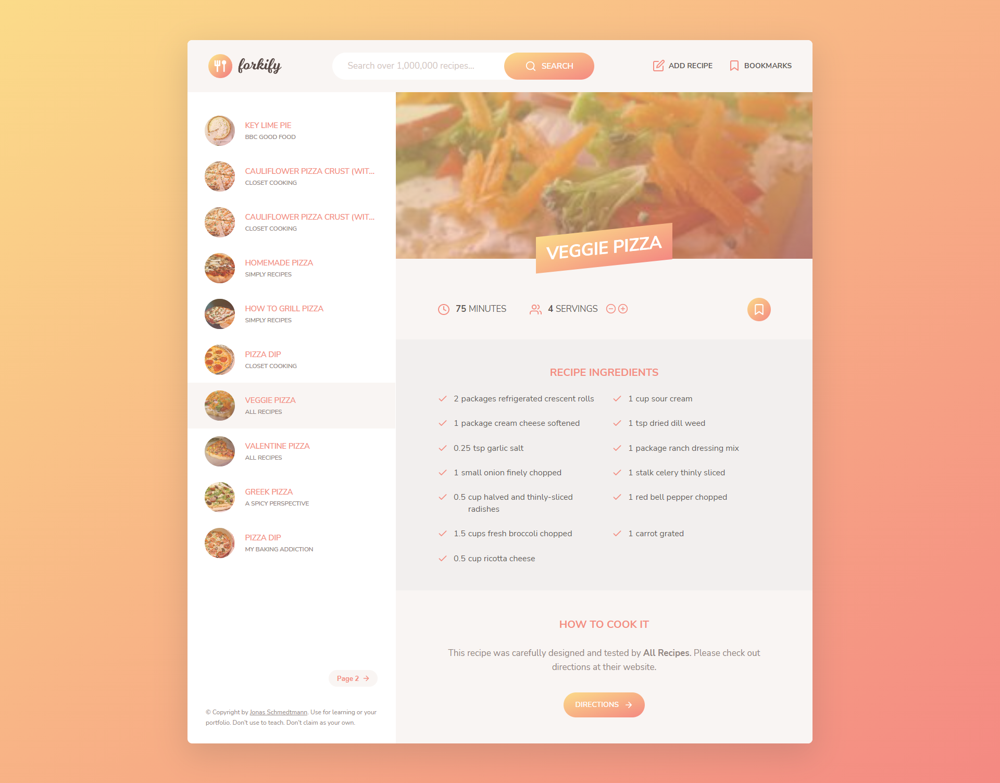

# Forkify
The recipe hub modern application that basically allows users to search for recipes and display them on the UI. 

## Features
This allows users to;
1. search for recipes, so that they can find new ideas for meals
    - Display results with pagination
    - Display recipe with cooking time, number of servings and ingredients
2. update the number of servings so that they can cook meal for different number of people
    - Change servings functionality: update all ingredients according to current number of servings
3. bookmark recipes, so that they can be reviewed later
    - Bookmarking functionality: display list of all bookmarked recipes
4. create my own recipes, so that they have them all organized in the same app
    - User can upload own recipes
    - User recipes will automatically be bookmarked
    - User can only see their own recipes, not recipes from other users
5. see my bookmarks and own recipes when I leave the app and come back later, so that they can close the app safely after
    - Store bookmark data in the browser using local storage
    - On page load, read saved bookmaks from local storage and display

[Link available here.](https://tantalizing-recipo.netlify.app/)

## Technologies Used
- HMTL/CSS
- Javascript (ES6 - classes, modules, promises, async/await and more)
- Parcel
- [External API](https://forkify-api.herokuapp.com/v2)
- Js Docs

## Architecture - MVC

## Flowchart

## Screenshots

## Live Demo

NB:

- Page is served with Parcel 
- Parcel need a way to access static files like images, therefore need to import images from images folder to js file
    - For images in dynamic html markup in js, need to import images the html with Parcel