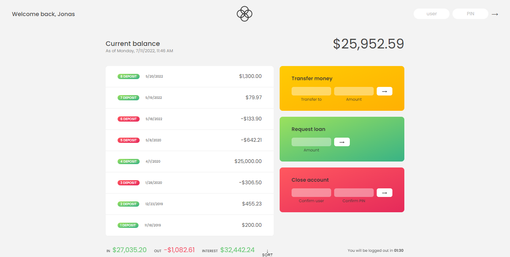

## Bankist
A minimalistic javascript-based banking application with the following features;
- transfere funds (attaches date)
- request loan (attaches requested date)
- display statements
- sort statement
- close account

Link: https://ephemeral-frangollo-d097b7.netlify.app/5-numbers-dates-internationaling-timers-bankist/

### Tools
- HTML/CSS
- Pure Javascript (ES6+)

## App Testing
Experiment with these User pins:
```js
user1: js        user2: jd
pin1: 1111       pin2: 2222
``` 

## Flowchart


## Demo 
* Screenshot <br>


* Live demo <br>


https://user-images.githubusercontent.com/29948157/178261888-6a49ea15-7558-4aea-b45c-9fd2bbd32e03.mp4


<sub>Inspired by &copy; Jonas</sub>
