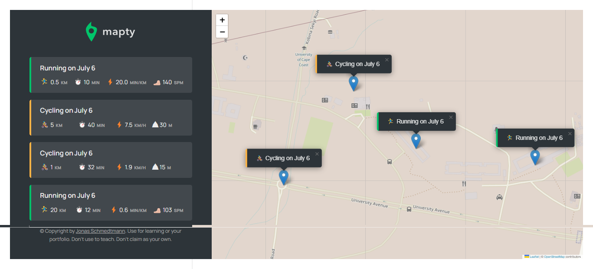

# Mapty
An stand-alone application that gets your current geolocation and allows you to log your workouts on map.

## Technology used
- Javascript (vanilla, ES6, OOP, Geolocation, Local storage)
- [Leaflet library](https://leafletjs.com/)

## Demo 
* Screenshot <br>


* Workflow <br>
[Mapty](https://j.gifs.com/pZqpqN.gif)


[](https://gifs.com/gif/Eq2Mqk)


#### lq


<br>
```html
<iframe src='//gifs.com/embed/Eq2Mqk' frameborder='0' scrolling='no' width='440' height='400' style='-webkit-backface-visibility: hidden;-webkit-transform: scale(1);' ></iframe>
```
<sub>Inspired by &copy; Jonas</sub>

