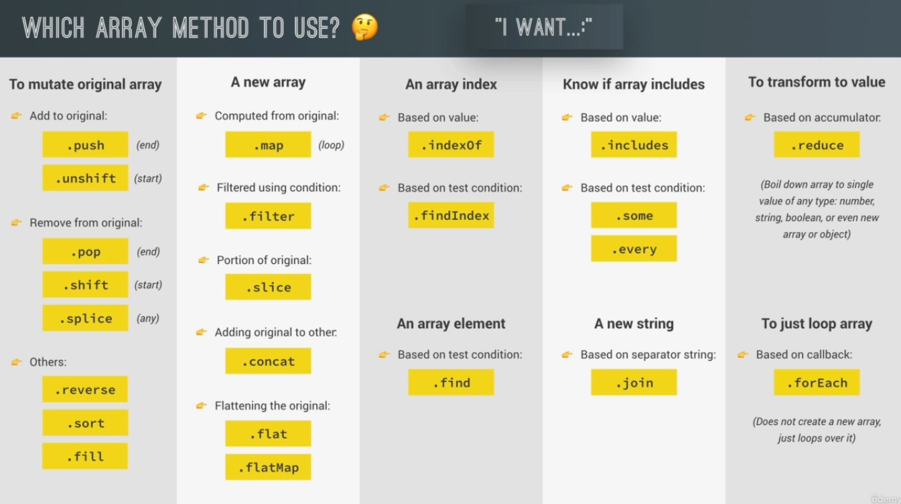

## Basics
1. <script></script> tag adds js to html page. two ways:
    - inline or
    - external script file
2. Data types
    - Undefined: datatype assigned to a variable w/ 'no value yet'...ie, empty value
    - Null: means 'no-existent'
        - Undefined: datatype of variable w/ no value yet
    - Null: means variable 'no-existent'
3. Falsy
    - values evaluated to false...the 5 falsy values; undefined, null, 0, '', NaN
4. Function
    - function expression returns a value
    - **stored in variable, say x = function(y)**
    - x is called instead....x(param)
    - expressions = anything that returns/produces a value
    - statement = just actions, ends in ';'
    - 2+3...an expression cus produces a value/result
    - **user fxn expressions over fxn declarations**
    - arrows: declare, `const x = y => y + 1`...use, `const z = x(y)`
        - used when function has just one line of code
5. Object
    - ```x = {y: 2}``` <= means object _literal_
    - _dotNotation_ `x.y` or 
    - _bracketNotation_ `x['y']`...this's _computable/dynamic_
    - can have function property...**function expression as key/value property**
        - access as `obj.function(arg)` / `obj["function"](arg)`
    - object is mutable...ie, can change their prop values
6. Concepts
    - Variable mutation: changin' var value
    - Type coercion: converting from one type to another automatically
    - Tackling any problem (4 steps)
        - **Understand** 100% by asking the right questions for clear picture
        - **Divide and conquer** by subtasking
        - **Research**
        - Devise a **plan**. For bigger problems, write a psuedo-code b4 actual code
7. Ternary operator: can store their return value
    - **ternary computed in string template**
8. Brief History
    - Brendan Eich created 1st version of Js in 10 days, called **Mocha** 
    - Was changed to LiveScript
    - In 1996, was changed to JavaScript to 'attract Java developers'.
        - meanwhile, **has nothing to do with Java** - marketing strategy
    - 1997: ES1 (ECMAScript 1) became the 1st version of JavaScript languade standard
    - 2009: ES5 (ECMAScript 5) released
    - 2015: ES6/ES2015 (ECMAScript 2015) released. **the biggest update to the language ever**
    - After 2015: changed to an **annual release cycle**
    - **2016/2017/2018/2019/...** : Release of **ES2016(ES7)/ES2017(ES8)/ES2018(ES9)/ES2019(ES10)/...**
    - ES5: 
        - supported in all browsers
    - ES6/ES7/ES8: 
        - supported in **modern** browsers, but not in older browsers
        - Most features can be used in production by **transpilling and polyfilling (converting to ES5)** ^^
    - ES9/ES10:
        - called **ESNext**, including future versions
        - not all features supported in all modern browsers
        - Can use most features in production by **transpilling and polyfilling** :)
9. Function xpression vs fxn declaration
    - use **fxn expressions over declarations**
## How Js works behind the scenes
- Definition w/ the 9 monter terms: Js is a 
    - **high-level**, 
    - **prototype-based object-oriented**
    - **multi-paradigm**
    - **interpreted/Just-in-time compiled**
    - **dynamic**
    - **single-threaded**
    - **garbage-collected** lang with 
    - **first-class functions** and
    - a non-blocking **event loop concurrency model**
### JS Runtime in the browser
- Overview::The Js Engine - program d@ execute js code, 
    - contains the **heap** & **call stack**
    - **call stack**: uses the **execution context** to execute code
    - **heap**: memory pool storing all objects
- How execution happens::Compilation vs Interpretation
    - Compilation: convert entire source code to machine at once, and write to portable binary file, to be executed by any computer
        - file can be executed way after compilation
    - Interpretor: runs through source code, convert to machine code and execute line by line, all at same time
        - **js used to be intepreted** but now NOT true
    - **Just-in-time (JIT)**: convert entire code to machine at once, then execute immediately line by line
        - no portable file generated to be executed later
        - mix b/n the two.
        - **how modern JIT compilation works in JS?**
            1. parse the source code
            2. creates an AST tree
            3. takes the AST and compile into machine code, JIT
            4. machine code executed right-away, in the **Call Stack**
            5. during execution, background optimization happens on special thread (outside the call) but inside the engine
- Outside the Engine is the **callback queue** thats queues waiting events
- Events are moved **from the queue to the call stack** when the call stack is empty, by the Event loops
- **Web-APIs** like the DOM, Console.log, Fetch API is provided to the engine for access to browser objects
#### The JS Runtime's picture box
- The Js Engine
- The Web APIs
- The Callback Queue

This is an overview of what happens to our code hosted in the browser
- The host has a Js Engine: program that takes the code and execute
    - This is what happens inside the engine;
    - **Parser** read our code and validate the syntax
    - If valid, a data structure called **Abstract Syntax Tree** is produced by the Parser
    - **Abstract Syntax Tree** is then translated into **matchine code**
    - Now, code is run by the **processor** and does its work 

### The execution contexts (EC) and the execution stack (ES)
Code run in an env called execution context. A box/container/wrapper that stores vars and in which our code is evaluated and executed 
    - by default is the Global Execution Context
        - code **not inside any function**
        - it's the window object in browser
        - only one GEC
    - runtime stacking
        - global execution context > execution context (on top) > execution context (on top)
        - then pops each exe context off the stack after completion
        - one execution context per fxn call

#### The EC in detail
- the EC Object. Has 3  ff props;
    - Variable Object (VO)
    - Scope chain
    - "This" variable
- Goes through 2 phases in the ES
    1. Creation phase.
        1. Creation of the VO
            - Arg object created to store all args passed into the fxn
            - Var declarations are scanned: a property is created in the Variable Object for each variable, and set to **undefined**
            - Function declarations are scanned: a property is created in the Variable Object for each fxn, **pointing to the function** 
            - **NB**: Var + Function declarations = **Hoisting**
                - Means: they're available before the execution phase starts
        2. Creation of the scope chain
            - Each new fxn creates a scope: the env/space in which the vars if defined and accessible
            - **Lexical scope** means that in a lexically nested **implemented** function, the inner functions (**not function declarations**) have access to the (scope) variables and other resources of their parent scope.
            - But it doesn't work backward to its parents, meaning the child scopes not available to its parents.
            - This means that the child's functions are lexically bound to the execution context of their parents.
            - Scope chain **doesn't relate to the order in which method called** but rather **where it is written** 
                - const varibles are **block(eg, if-else) scoped** 
                - var variables are **function scoped** even when defined in **block scope**
                    - var type **create a property on the global window object**
                - **that is the reason to always use const/let** unless in legacy code
                - declarable functions **can be block or function scoped** depending wether in strict mode or not
        3. Determine value of **'this'** var
            - In a **regular function**, the **this** points to the global object (ie, window object in the browser)
                - In a **method**, the **this** points to the object that (**defined**) called the method, ie, the owner of the method
                    - points the custom object within which it is defined, otherwhise the global
                    - **method borrowing**: `x.a = y.b`
                    - this is **not static**  
                - In regular method **call**, the 'this' is **undefined**/window global obj, because not called by object
            - In **arrow function**, 'this' is the **'this' of the surrounding/parent function** (ie, lexical 'this'). Arrow fxns **does not get their own 'this' keyword**...
                - nb: **don't use** 'this' ins arrow fxns
            - In **event listener**: 'this' is the **DOM element that the handler is attached to**, ie. the dom element owning the handler
            - The 'this' will **NOT** point to the function itself or the variable environment
                - use a **regular function declaration/expresion** over **arrow function** to avoid the 
    2. Execution phase
        - Funtion's code d@ generated the current EC is ran line-by-line

** NB:
    - scope => 'where do variables live?'
    - 3 types of scopes: global scope, function scope, block scopes (let, const)  
### Js _Hoisting_
- means some variables can be used/accessed in the code before they're actually declared/defined/body-written
    - in short "variables lifted to the top of their scope"
    - eg. var type variables are 'hoisted' before even being asigned a value
        - initial value: **undefined**
    - eg. functions declarations are declared on top before actually being defined
        - initial value: actual funtion
    - eg. function expressions are not hoisted
        - intial value: unintialized, Temporal Dead Zone (**TDZ**) - defined but can't be used unless has value
- how hosting really happens?
    - before execution (in the context execution inside the call stack), code in scanned for variable declarations, and for each variable, a new property is created in the **variable environment object**.
        - if it knows that variables are declared beforehand, it will be set to undefined when you want to use
            - **var** type is undefined cus hoisted
            - **const and let** type is uninitialized cus **not hoisted**... in TDZ mode
        - if you want to use a function before being declared, it will point to that
    ```js
    variableObj = {
        x: undefined,
        y: z()
    }
    ```
- applies more on regular functions not function expressions
- examples
```js
console.log(a)  // undefined
console.log(b)  // uninitialized, TDZ
console.log(c)  // uninitialized, TDZ

var a = 'a';
const b = 'b';
let c = 'c';
```

### Premitive values vs Reference values
Premitive values: values string, numbers, etc
- stored in **call stack**
- new address is created in stack when copied to another
```js
let a = 'a';
let b = a
b = 'b'

// a = 'a'
// b = 'b'

```
Reference values: values of objects
- stored in **heap**
- obj can't be stored in stack cus it's huge so only it's memory address is reference in the stack
```js
let me = {
    sn: 'erb',
    age: 25
}
let friend = me;
friend.age = 26;

// me = { sn = 'erb', age = 26 }
// friend = { sn = 'erb', age = 26 }
```
- new variable, not created w/ new address but rather points to the same object address in the call stack (referenced from the heap)...thus affecting existing value

## DOM Manipulation
DOM: structured rep of an html doc, used to conn webpages to script like Js
    - Js helps to access and manipulate the dom
Events
    - notifications sent to notify a code that sth happened on the webpage
    - unlike regulare fxns that are **called**, **event listeners** are also fxns but perform action based on event. They wait for specific event to happen, like click a btn, scroll, key press, etc
    - how are events processed
        - events can only be handles/processed as soon as the Execution Stack is empty. 
        - events are stored in a **message queue** waiting to be processed 

## Object Inheritance and the Prototype Chain
- Every Js obj has a **prototype property**, which makes inheritance possible in Js
- The prototype property is where methods and properties that will be **inherited by other objects** are put
- The Constructor/Class's prototype property is **NOT** the prototype of the Class **itself**, it's the prototype of **all** instances that are created through it.
- When certain meth is called, that meth is being searched for in the obj itself, and it cannot be found, the search moves to the mother Object's prototype. This search continues until meth is found. This is called **Prototype Chain**
- Useful instance fxns
    - `hasOwnProperty`
    - `instanceOf`
    - `_proto_`

## Data Structures, Modern Operaters and Strings
- Array destructuring: unpacking var data
    - switching vars
    - nexted distructuring
    - setting default values
- **Object destructuring**
    - always set default values
- **Spread operator**: used whenever need to expand elements from array individually  
    - `...x`...`n, n1, n2`
    - mostly used on _iterables_: array, set, map
        - used on objects as well
    - useful in place that expect items separated by comma
    - 2 useful case
        - ...to build/join arrays
        - ...as param to function
- **Rest pattern**: packs element of array
    - lookup :)
- Ternary
    - to set default value where 0 and null are invalid (replaceable with `||` Short-circuiting)
    - replaces one-line if-else blocks
- Short-circuiting with or and &&
    - `&&` => to **replace one-line if-condition without the 'else' part**
    - `||` => to set default value where 0 and null are invalid
- Null colescing value
    - **always use to replace default value setup w/ ternary (when 0 is considered valid)**
    - for only `nullish` property
- Optional chaining
    - checks if property exist before access
    - **used w/ null colescing to set default**
    - `a.b?.c ?? 'default'`
- **For-of loop**
    - get index with `.entries()`
- Enhanced object literal
    - object literal => you literary build an object without using any api, just using `{...}`
    - **keys/property names can be computed** not just the values
- Set
    - accept an iterable eg, array
    - **specific item is not retrievable because order doesn't matter, ie no indexes**
    - can check whether an element exists
- Maps vs Object
    - object **keys are always string** whilst map **keys can be any type**
    - maps: 
        - when need **any** type as keys
        - easy to iterate and compute size
        - when need map keys
    - objects: 
        - easy to access with . and []
        - when working with json
        - when need only string as keys and *need to include methods* as value
- Arrays vs Sets
    - arrays: 
        - used when need **ordered** list of values
        - when can contain **duplicates**
        - when need to manipulate data
    - sets: 
        - used when need **unique** values
        - when **high-performance** is important
- Strings
    - most useful methods: 
        - expression: `.slice(), .trim(), .toLowerCase(), .toUpperCase(), .replace[All]()`
        - conditional: `.includes(), .startWith(), .endsWith()`
        - array: `.split(), .join()`
        - `.padEnd(), .repeat()`
    
## Functions: A closer look
- **Pass arg by value vs reference**
    - by value:
        - for premitive types
        - arg value is copied to into param value
        - diff addresses thus independent of each other
        - change on one doesn't affect the other
    - by reference
        - for non-premitive types
        - arg address is coppied to param, ie pointing to same address
        - change on one affect the other
    - js does **NOT have pass by reference** even though it looks like 
        - the reference is a value containing memory address 

- **First class and Higher order functions**
    - 1st-Class fnxs
        - functions treated as 1st class
        - means functions are simply **values**
        - functions are just another **'type' of object**
        - functions can be
            - stored in a variable
            - passed as argument to another fnx
            - called on another fnxs
    - Higher-order fnxs
        - fnxs that recieves anther fnx as arg or returns another fnx or both
        - `btn.addEventListener('click', greet)`
            - `addEventListener` = higher order fnx
            - `greet` = 1st class fnx
        - Function returning another function
        - the call() and apply() and **bind()** methods
        - IIFE
        - Closures
## Working w/ Arrays
- .splice() / .slice() / .reverse() / .join() / .pop()
- forEach loop 
    - is a higher-order function that takes a callback fxn
    - in Arrays
        - **forEach comes with index & the entire array**. eg; `numbers.forEach((number, index, numbers) => log(number, index, numbers))`
        - loop is not breakable
            - always loop over the entire array
            - **continue and break statement doesn't work in forEach loop**
            - **to break out of the loop, use For-of loop**
    - in Maps
        - **forEach comes with the value, key & the entire map**. eg; `numbers.forEach((value, key, numbers) => log(value, key, numbers))`
    - in Sets
        - **forEach comes with the value, throw-away & the entire set**. eg; `numbers.forEach((value, _, set) => log(value, set))`
            - **_** implies throwaway variable
                - means ***variable is unnecessary or unused*
- Data transformation
    - Map, Filter, Reduce
    - Map: 
        -**Has index**
        - .map((item, **index**, array) => ...)
        - **used when wanna return a new array**
            - unlike `forEach` that just does causes **side effect** on the orginal, ie does some sth/modifying without returning
    - Filter:
        - conditioned to return new array
    - Reduce:
        - .reduce((**accumular**, currentItem, index, array) => ..., **initialValue**)
        - initialValue => value before the first iteration even starts
            - just like initializing `int accumular(sum) = 0` before for-loop
        - usages;
            - any operation that returns only one value;
                - for sum
                - finding max value
            ```js
            const max = movements.reduce((acc, cur) => {
                if(acc > cur) return acc;
                else return cur;
            }, movements[0])
            console.log('max', max);
            ```
    - NB: It's a **bad practice to chain methods(like `splice()`) that mutate the underlying original array**

- Find() method
    - returns only the 1st element which satisfies the condition
    - used to find only one matching element
    - vs Filter
        - **find doesn't return a new array but filter does**
- FindIndex() into Splice()
- Some()
    - checks if matches **any** of the condition
    - **similar to includes()** some(x => x == match)
- Every()
    - returns truthy if every item matches given condition
- **Flat(), FlatMaps()**;
    - Flat = flats nested (on n-deep level) arrays
    - FlatMap = `.map(..).flat();`
- **Programmatically creating and filling arrays**. using;
    1. Array constructor + .fill()
    2. Array.from({length: 5}, callbackFxn)
        - fill the array by using callbackFxn like in .map(), but only the index is needed
        - most preferred
        - .querySelectorAll() yeilds a nodeList which is does not have array methods
            - so Array.from() can be used to create a real array from that
        - usage similar as the spread operator (...)
- array cheatsheet


## Numbers, Dates, Internationalization, Timers
- Numbers
    - Number.parseInt(), Number.**parseFloat('10px')**,
    - Number.isFinite(), - **better to check if sth is a number not stringified number**
- Math and Rounding
    - **Math.min/max()**
    - `trunc(), ciel(), floor()`
- Remainder
    - %
- Big int
    - Numbers
        - max bit: 2^64
        - max number: 2^(53-1) 
        - **same as `Number.MAX_SAFE_INTEGER`**
    - Big int help get number beyond the max int number
        - using '**n**' postfix
        - eg: `23333333333333333333334444444444444444444n`
- Dates
    - **Timestamp** is the **milliseconds**
        - eg `getTime()`
    - **.getFullYear()** over getYear()
    - `.toISOString()`
        - eg '2019-11-18T21:31:17.178Z'
    - **.padStart(2, 0)** useful to get 2 digits for minute, hour, day, month
    - date operations
        - **timestamp (in ms) is useful**
- **Internationalization**
    - format dates based on location or country
    - **search "iso language code" to format date**
    - **can determine local from browser programmatically**
        - `navigator.language`

- **Timers**: 
    - setTimeout
    - setInterval

## Advanced DOM
- How DOM really works
    - DOM is basically an interface b/n Js and Browser
        - allows make Js interact with browser
        - help us write js code to create, modify and delete html elements; set styles, classes and attributess; listen and respond to events;
        - help us interact with the DOM tree from an HTML document
        - DOM contains APIs (methods and properties) to interact with the DOM tree
    - every element is represented as **Node** object, each node, eg ``<p> Paragraph text </p> <!-- Comment -->` consist of the following types of subNodes;
        - element `<p> ... </p>` 
            - has HTMLElement type, with downlevel types like HTMLButtonElement, HTMLDivElement. 
            - One type of HTMLElement per HTML element, each has access to different properties/methods for each type
        - text `... Paragraph text ...`
        - comment `... Comment ...`
        - document
            - is another type of SubNode
            - has access to `.querySelector(), .getElementById(), etc`
    - The Node object also inherits from a super class object called **EventTarget**
        - which has access to these methods - `.addEventListener(), .removeEventListener()`
        - this makes it possible for child nodes to add and listen to event listeners
- Selecting, Creating and Deleting ELEMENTS
    - follow-up with the `.js` files for illustrations
- Styles, Attributes and Classes
    - `.styles`
        - computed styles
    - .attributes...`getAtrributes()`
    - `.ClassLis`t
    - follow-on source .js file
- Types of Events and Eventhandlers
    - adding events listeners
    - removing event listener
- Event Propagations: Bubbling and Capturing
    - Events travels from the root element down to the target element, and then handled. This is called **Capturing**. After handled, event then travels all the way up to the root again called **Bubbling**
    - This means: when an event is also handled by any of the target element's parents, it will be handled twice - the parent and child target element.
- DOM Traversing
    - walking through the DOM
        - selecting an element relative to another element
        - sometimes direct child or parent
        - when we don't know the structure of the DOM at runtime
    - getting child element(s)
        - `.querySelector()`
    - getting parent element(s)
        - `.closest()`
    - getting sibbling element(s)
        - `next[previous]Sibling()`
    - follow-up to .js file
- Building Tapped component
    - guard clause
- Passing Arguments for Event Handlers
    - followup to 'mennu fade animation'
- Sticky Navigation
    - not implemented in js file
- Building Slider / Carousel
    - not implemeted
- Lazy Loading Image
    - not implemented in js file
- Life Cycle DOM Events
    1. `DOMContentLoaded` event: triggered when HTML, and internal Js script loaded with the DOM tree built...but exeternal resources like images are not yet loaded
    2. `load`: triggered are the page has fully loaded with images and resources done downloading
    3. `beforeunload`: triggered just before the page is about to be closed...can be used when user is in the middle of filling a form and that can lose data when closing the page
- Efficient js Script loading
    - regular synthronous at end of html body
    - `async` in html head
    - **`defer`** in html head
        - best for developer custom script
        - script fetched async and executed after html is completely parsed
        - order in executed with html and script

## OOP
- What it is.
    - OOP principles
        - Abstraction: **hiding** class members(properties/methods) / details that **don't matter**
            - **Exposes** only required members that will be interracted with
        - Encapsulation: keeping class members **private**
            - Makes members **not accessible from outside** the class
        - Inheritance: making members of certain class **available to child class**. 
            - Ensures **common logic reuse** in class relationship 
        - Polimorphism: child class can **overwrite** method inherited from parent
- OOP in Js
    - Class in Java === **Prototype** in JavaScript
    - Instantiation in Java === **Prototypal Inheritance/delegation in Js**
    - 3 Ways of creating Prototypal inheritance
        - **Constructor functions**
        - ES6 Classes
        - Object.create()
- Prototypes
    - sort of like a class in Java
    - `Class.prototype.somemethod()` on Class prototype
    - `__proto__` property on objects
        - linkes object to its class properties
    - refer to implementation
- Prototypal Inheritance on Built-In Objects 
    -  Prototypal Inheritance is how js classes work
    - `__proto__` to lookup parent chain...from child object to top-level parents
    - refere to implementation
- ES6 Classes
    - Makes it easier for devs from OOP background to adopt to js classes
        - syntactic sugar for function constructors
    - Classes in js **doesn't really work like traditional classes** in languages like Java
    - 2 types of implementation
        - 1. Class expression
        - 2. Class declaration
            - most preferred by devs from oop background
    - Key things about classes
        1. Classes are **NOT hoisted**
        2. Classes are first-class citizens: can be **passes into functions and return them from fnxs**
        3. Classes are **executed in strict mode**
    - refer to implementation
- Getters and Setters
    - help **access methods as properties instead of funtions**
        - `instance.age` instead of `instance.age()`
    - Getters
        - Help access properties but still need to perform calculation before
    - Setters
        - Help perform data validation before setting data to class property

## Asynchronous - Promises, Async_Await, and AJAX
- Asynchronous
    - Synchronous
        - code runs and execute line by line (in the execution thread) in the order written
        - example 
        ```
        const a = 'a';
        alert('text');
        const b = 'b';
        ```
        - each line of code waits for previous line to finish
        - Problem: if a line of code takes a long time to run
        - it blocks the rest of the execution
        - long-running operations *block* code execution
    - Async
        - means 'not occuring at same time'
        - code is executed **after a task that runs in 'bg' finishes**
            - code is non-blocking
            - **callbacks alone doesn't make code asyncronous**
            - **since called by another fxn (and not us), () brackets is not required**
- Promises
    - an object that is used as a **placeholder for the future result of an async operation**
        - simply **a container for a future value**, that will be delivered asynchronously
        - eg: lottery and bet ticketing
    - benefits:
        - **replaces useage of events & callbacks** to handle async results
        - easy **chain of promises** for sequence of async operations, instead of callback hell
    - **life cycle**
        - 1. Pending state: **before** future value is available
        - 2. Settled states: async tasks **has finished**. either
            - Fulfilled: Success! The result is now **available**
            - Rejected: An **error** happened
    - To consume a promise,
        - you need to **have a promise already**
        - or need to **create one**
        - where a Promise is returned
            - the **`.then()` is called on it for the value**
            - `response.json()` **also returns a Promise**, thus `.then()` needs to be called on it
    - Error handling
        - `.catch(err => ...)`
        - each callback error can be caught/handled 
        - need to be **handled globally by being the last in the callback chain**
        - `.finally()`
            - runs whether promise is success / not
            - use case: **handle loading spinner**
                - hide spinner wherether success / not
    - Throwing error manaully
        - what if 404, means promise was not rejected(no error occurs), success just that no data is found
            - this needs to be handled manually
        - **handle custom error with the `.ok` property on response**
            - `if(!esponse.ok) throw new Error('sth went wrong')`
        - **manaually throw any error, that the Promise global catch() might not be able to catch automatically**
- How async works behind the scenes in the runtime within the
    - call stack
    - web API
    - callback queue
    - micro-task queue
- Creating promises
    - Promises are consumed most often, but a use case for creating one is by wrapping callback fnx with a Promise
        - this is called Promisifying
    - **promising Function should return** a `new Promise((resolve, reject)...)` like this
    ```
    const downloadImage = function (imgPath) {
        return new Promise((resolve, reject) => {   // returns a promise
            // do some work
            resolve(theImageResult)

            // work leading to error
            reject(new Error('Image not found'))
            
        })
    }


    downloadImage.('path/img').then(img => console.log(img))
                              .catch(err => console.log(err))
    ```
    - note that `resolve` and `reject` are callback functions
    - Creating promise and resolving immediately using static method.... ``Promise.resolve()....Promise.reject()``
    - if **resolve has no parameter, means it returns nothing**
    - **waiting for all promises:** `Promise.All()`
- Async / await
    - mark function as async
    - **has at least one await operation**
    - **await any funtion that returns a promise**
    - it's is synthetic sugar for writing Promises/then
    - makes code looks syncronous but it's async under the hood
- Handling async / await error
    - use **try-catch block**
    - **never ignore handling error esp with async functions**
- Returning values at top-level funtion
    - `.then()` can be called on async methods but not a good practice
        - mixes async with promises
    - use **async with IIFE with await with try/catch**
    - use **await to get the value from a Promise operation**
    - if `Promise{<pending>}`, then **just `await` for the result**
- Running promises in parallel
    - when promise operations are independable, it's good to run them in parallel using
    -   ```
        await Promise.All([...promises])
        ```
    - it **short-circuit** when one fails
- Promise **Combinators**
    - **Promise.All**.......returns an array
        - short-circuits if **there's a rejection**
        - important
    - **Promise.Race**......returns only one value, res[0]
        - used with **timeout()** to cancel long request
        - important
    -  others:
        - Promise.settleAll
        - Promise.any
    - map with asyn / await 
        - **since `createImage()` is a promise, it needs to be awaited thus callback param should be asynced**
        - *map() with Promise.all() is very handy*
    ```
    try {
        const imgs = imgArr.map(async img => await createImage(img));   // returns array of Promises
        const imgsEl = await Promise.all(imgs); // await them to get the fulfilled values from the promise array
        console.log(imgsEl);
    } catch {

    }
    ```
## NB
Enable strict mode in JS to write secure code